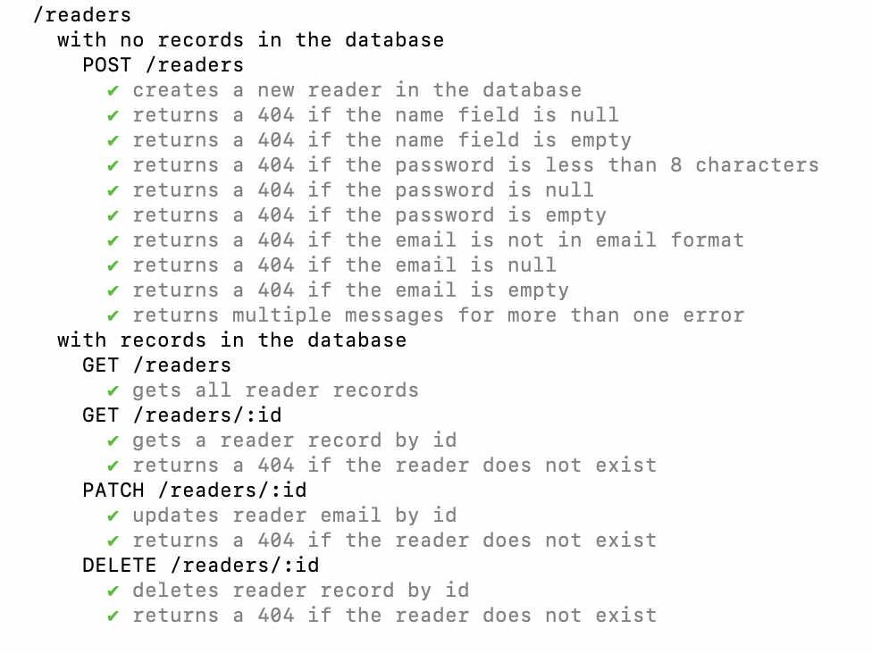
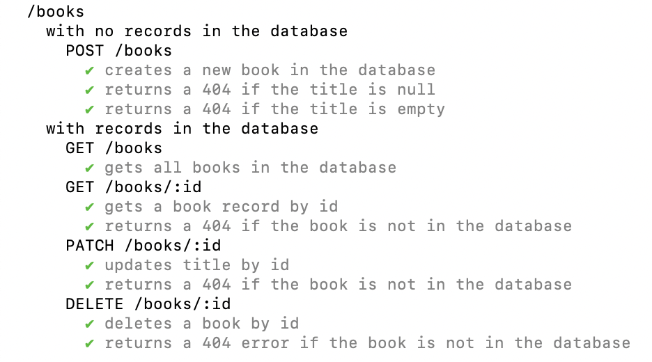
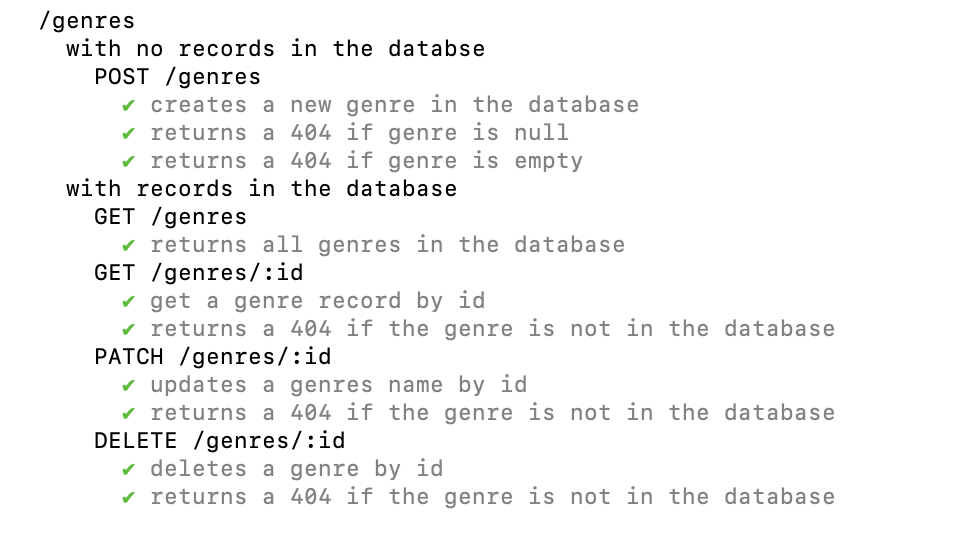
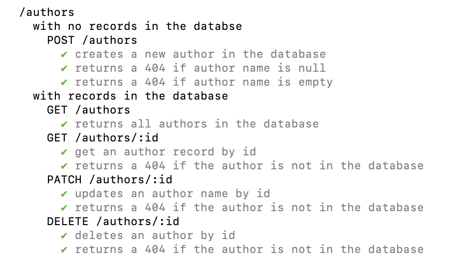

# Book Library App
To practice:
- Creating Express APIs
- Databases
- Sequelize

## Objectives
- Interpret user stories to create requirements and features
- Set up an Express API using node-postgres, Sequelize, Mocha/Chai, and Supertest for testing.
- Use advanced Sequelize schema validation, error handling and establish complex relationships between database tables

## User Stories
1. As a library customer, I want to create an account with my name, email address, and password so I can list and borrow books from the online library.
2. As a library customer I want my password to not be returned by the API so my account is more secure.
3. As a library customer I want to receive an error if the email address I sign up with is not valid so I can receive emails.
4. As a library customer I want to receive an error if the password I sign up with is less than 8 characters long so my account is more secure.
5. As a book lender I want to be able to create a book listing on my account with a title, author, genre and ISBN number so people can loan my books.
6. As a library customer I want all book listings to have at least a title and an author so I know what I’m looking at.
7. As a library customer I want to see a list of all books so I can find books to borrow.
8. As a library customer I want to be able to search for books by a specific title, author, genre or ISBN so I can find books I’m interested in.

## Set up
1. Set up Docker on your machine and run the following command:
`docker run --name postgres -p 5432:5432 -e POSTGRES_PASSWORD=password -d postgres`
2. Open pgAdmin4 and create a new server:
- host: localhost
- user: postgres
- password: password

3. Fork this repo and clone it to your machine.

4. Install dependencies:
`npm i`

5. Create .env and .env.test files in the root of the repository. Enter these values:
```
PGPASSWORD=password
PGDATABASE=book_library_dev
PGUSER=postgres
PGHOST=localhost
PGPORT=5433
```
Make sure to change the `PGDATABASE` value to `book_library_test` in .env.test.

## Use
You can start the app by running `npm start` in the terminal.

Once the app is starting, you can add records to the database as you please using the endpoints listed below.

You can also run tests with `npm test`.

## Endpoints

### /readers
*GET* **/readers**: returns all registered readers.
*GET* **/readers/:id**: returns a reader by ID.
*PUT* **/readers**: adds a reader to the database.
*PATCH* **/readers/:id**: updates a reader record by ID.
*DELETE* **/readers/:id**: deletes a reader record by ID.

### /books
*GET* **/books**: returns all registered books.
*GET* **/books/:id**: returns a book by ID.
*PUT* **/books**: adds a book to the database.
*PATCH* **/books/:id**: updates a book record by ID.
*DELETE* **/books/:id**: deletes a book record by ID.

### /genres
*GET* **/genres**: returns all registered genres.
*GET* **/genres/:id**: returns a genre by ID.
*PUT* **/genres**: adds a genre to the database.
*PATCH* **/genres/:id**: updates a genre record by ID.
*DELETE* **/genres/:id**: deletes a genre record by ID.

### /authors
*GET* **/authors**: returns all registered genres.
*GET* **/authors/:id**: returns a genre by ID.
*PUT* **/authors**: adds a genre to the database.
*PATCH* **/authors/:id**: updates a genre record by ID.
*DELETE* **/authors/:id**: deletes a genre record by ID.

## Tests
### Readers


### Books


### Genres


### Authors


## Future Versions
Future versions will contain:
- A graphical interface to interact with the program
- User can use the UI to create an account as a reader
- User can use the UI to create an account as a lender
- Lenders can upload books to the database
- Readers can borrow books from the database